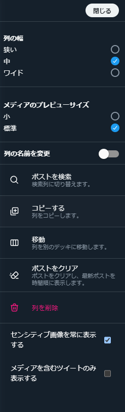

# Better X Pro

## Install - 導入手順

1. ZIPファイルをダウンロード
2. ダウンロードしたファイルを任意のフォルダに展開
3. GoogleChrome（またはChrome拡張機能に対応したブラウザ）で chrome://extensions/ を開く
4. 「パッケージ化されていない拡張機能を読み込む」で、展開したフォルダを読み込む
5. X Proを再読み込み

## UI追加
 - オプションの追加  
  各カラムのオプションメニューの最下部にチェックボックスが追加されます 
  

## Contribution

This project was bootstrapped with [Chrome Extension CLI](https://github.com/dutiyesh/chrome-extension-cli)
